### Challenge 

One of the biggest challenges that face any malware analysis is what is known as "Anti" techniques :
	Anti-VM,
	Anti-Debugging,
	Ani-Reversing,..etc

In this article, I will start investigating Anti-VM techniques and as I go I will keep adding to it once I found a new one.

### Sources

Here I will write the sources apps that I faced these Techniques in.

	ScoopyNg.exe (VMDetection app)
	VMDetector.exe (VMDetection app)

### VMDetector.exe

The program is written in .NET so using "dnspy" we can look at the source code

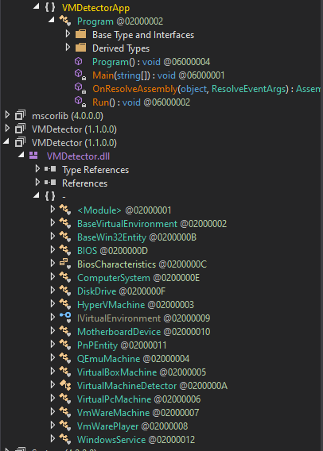

the main function points to the run method, and the decision is passed on a "flag" variable set by the "Assert" method inside the "virtualmachinedetector" class

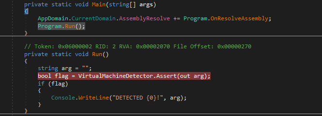

In the "Assert" method he gets a list of the Process running in the device and then Starts Enumerating the Machine For information

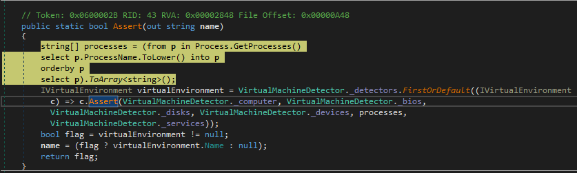

After collecting the information about the machine it will be passed to "detectors" to start looking for signs of different virtual machine vendors.

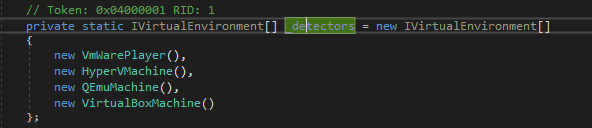

The contractor is the one responsible for getting the machine's information.

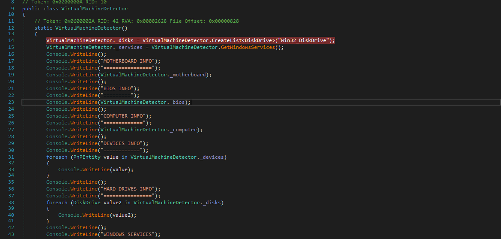

After getting Machine info now passing it to check functions to look for virtualization indicators.

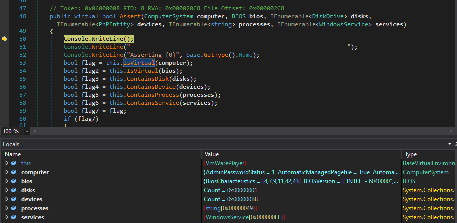

Every one function then is responsible for checking the gathered information and setting the corresponding flag.

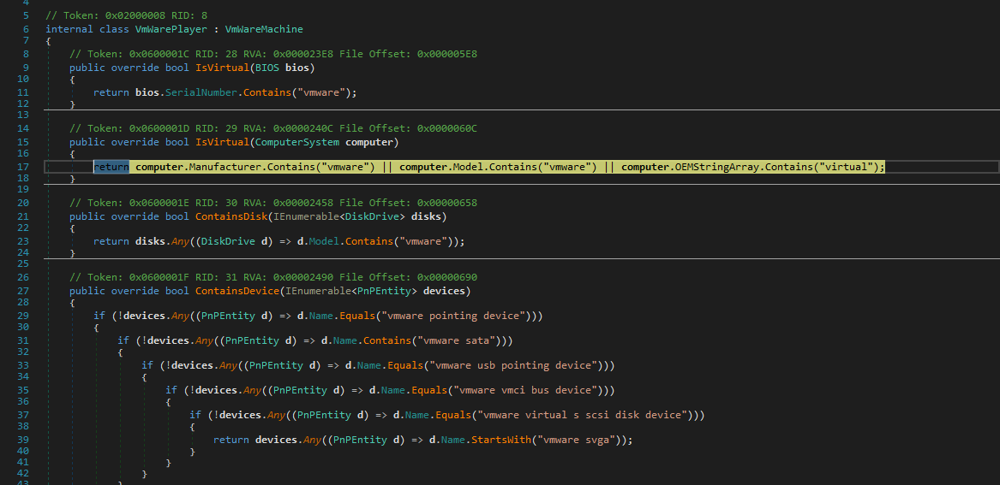

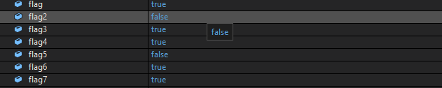

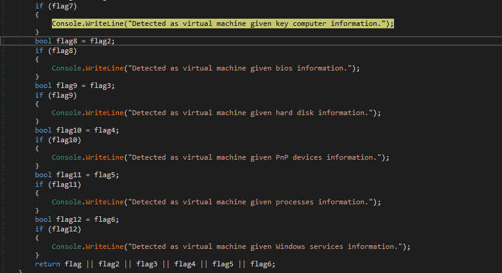

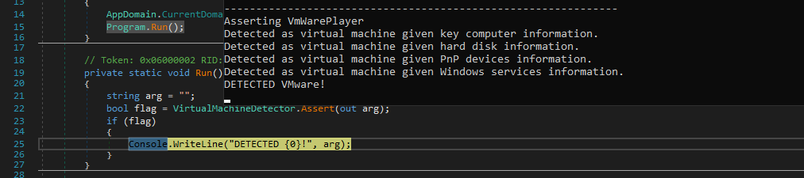

To bypass this technique you just need to dive into the app looking for the flags responsible for the decision made by the application and tampering with it just before the comparison for the decision.

### ScoopyNG.exe

The program is an x64 executable So we will fire up our disassembler to examine the Anti-VM techniques on it.

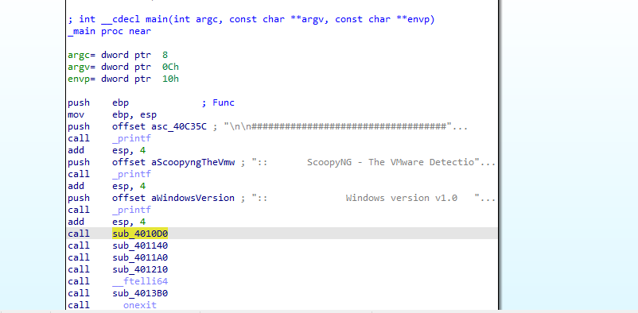

there are some functions at the main needed to be investigated so we will start them one by one 

The first one 

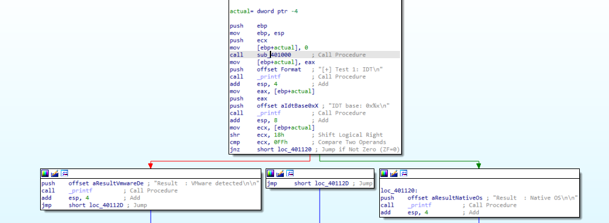

The first one has a function that is responsible for the decision and as we see it uses the instruction "sidt"
what is that?!!
"There is only one Interrupt Descriptor Table Register (IDTR), one Global Descriptor Table Register (GDTR), and one Local Descriptor Table Register (LDTR) per processor. Since there are two operating systems running at the same time (the host and the guest), the virtual machine needs to relocate the IDTR, GDTR, and LDTR for the guest OS to different locations to avoid conflicts. This will cause inconsistencies between the values of these registers in a virtual machine and in the native machine. The instructions SIDT, SGDT, and SLDT are assembly instructions that can respectively be used to retrieve the values of IDTR, GDTR, and LDTR"

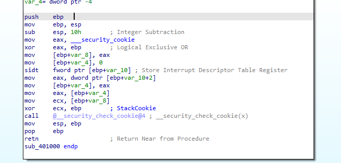

the next check has the same concept this time using "sldt" instruction

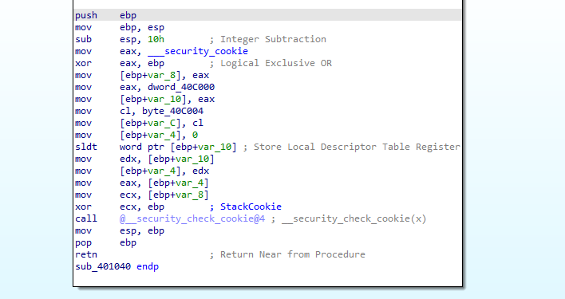

and the same for the third using "sgdt" instruction

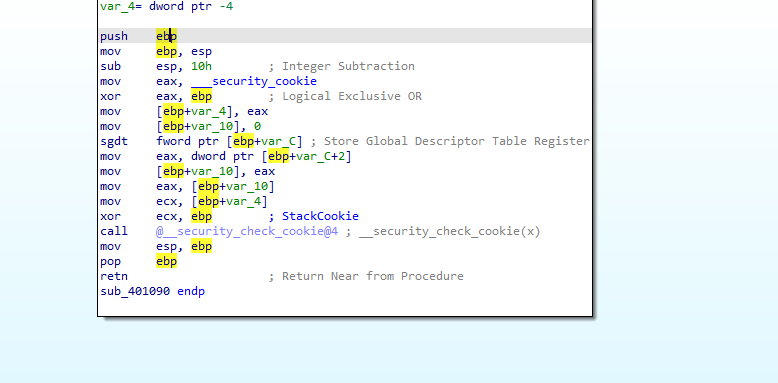

in the next one, we can see the instruction "str" 
What is that?!
The str instruction retrieves the segment selector from the task register, which points to the task state segment (TSS) of the currently executing task.

Because the value returned by this instruction will differ depending on whether it is run on a host or on a virtual machine.

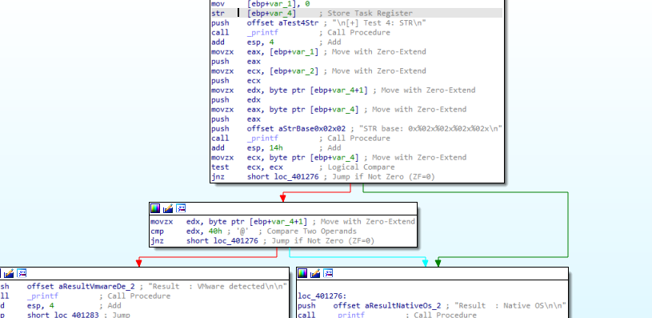

At the last check, we are checking the VMware by giving input to its input port and waiting for an answer.
At our function we see

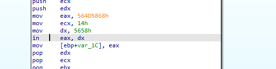

what are those instructions mean?!
here is an explanation example

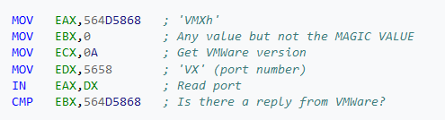

### Detections & Mitigations

in this section, I will try to document the solutions and automation that may help fast analysis

## you can add these lines to spoof some VM characteristics inside the "\*.vmx" file of your VM

	isolation.tools.getPtrLocation.disable = "TRUE"
	isolation.tools.setPtrLocation.disable = "TRUE"
	isolation.tools.setVersion.disable = "TRUE"
	isolation.tools.getVersion.disable = "TRUE"
	monitor_control.disable_directexec = "TRUE"
	monitor_control.disable_chksimd = "TRUE"
	monitor_control.disable_ntreloc = "TRUE"
	monitor_control.disable_selfmod = "TRUE"
	monitor_control.disable_reloc = "TRUE"
	monitor_control.disable_btinout = "TRUE"
	monitor_control.disable_btmemspace = "TRUE"
	monitor_control.disable_btpriv = "TRUE"
	monitor_control.disable_btseg = "TRUE"

Note: these values will affect your VM performance so just use them at the time you need them.

## Also you can write your scripts to look for specific instructions that used heavily in VM detection
 